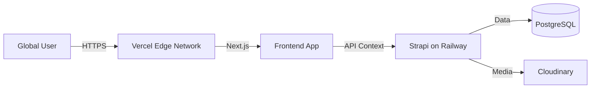

# Battivus Deployment Guide

> **Target Architecture**: Next.js (Frontend) + Strapi (CMS) + PostgreSQL (Database)
> **Recommended Stack**: Vercel + Railway + Cloudinary

This guide outlines the step-by-step process to deploy the Battivus Global B2B Website.

## 📋 Architecture Overview



---

## 🛠️ 1. Prerequisites (Accounts)

Before starting, ensure you have accounts with:
1.  **[GitHub](https://github.com)** (Code hosting)
2.  **[Vercel](https://vercel.com)** (Frontend hosting)
3.  **[Railway](https://railway.app)** (Backend & Database hosting)
4.  **[Cloudinary](https://cloudinary.com)** (Image/Media hosting)

## ⚖️ Option Choice: Railway vs. Strapi Cloud

You asked about **Strapi Cloud**. Both are excellent options.

| Feature | Option A: Railway (DIY PaaS) | Option B: Strapi Cloud (Official) |
| :--- | :--- | :--- |
| **Cost** | **Lower** (~$5-20/mo) | **Higher** (Starts at $29/mo) |
| **Setup** | Moderate (Connect Git, set ENV, add DB) | **Easiest** (Push & Click) |
| **Maintenance**| You manage DB updates/backups | Fully Managed |
| **CDN/Email** | Setup separately (Cloudinary/Resend) | Included (Asset hosting + Email) |
| **Best For** | Cost-sensitive / Technical teams | Teams wanting zero-ops / Speed |

---

## 🗄️ Option A: Backend Deployment on Railway (Recommended for Flexibility)

Railway is chosen for its ease of use with Docker and Postgres.

### Step 2.1: Prepare Repository
Ensure your project is pushed to GitHub.

### Step 2.2: Create Railway Project
1.  Log in to Railway.
2.  Click **"New Project"** -> **"Provision PostgreSQL"**.
3.  This creates a database container.

### Step 2.3: deploy Strapi
1.  In the same project, click **"New"** -> **"GitHub Repo"**.
2.  Select your repository (`Battivus`).
3.  **Important**: Railway usually detects the root. Since Strapi is in `cms/`, we need to configure the **Root Directory**.
    - Go to **Settings** (for the repo service).
    - Set **Root Directory** to `/cms`.
4.  **Configure Build Command**:
    - Railway automatically detects `Dockerfile` or `package.json`.
    - We recommend using the provided `Dockerfile` or `Dockerfile.prod`.
    - If using Dockerfile: Set **DockerfilePath** to `Dockerfile.prod` (if customized) or just use default.

### Step 2.4: Environment Variables (Railway)
Go to the **Variables** tab in your Strapi service and add:

| Variable | Value | Description |
| :--- | :--- | :--- |
| `NODE_ENV` | `production` | Production mode |
| `DATABASE_CLIENT` | `postgres` | |
| `DATABASE_URL` | `${{Postgres.DATABASE_URL}}` | *Railway auto-references the DB service* |
| `JWT_SECRET` | *(Generate Random String)* | Security key |
| `ADMIN_JWT_SECRET` | *(Generate Random String)* | Admin security key |
| `API_TOKEN_SALT` | *(Generate Random String)* | API token salt |
| `APP_KEYS` | `key1,key2,key3,key4` | Random strings comma-separated |
| `CLOUDINARY_NAME` | *(From Cloudinary)* | Media storage |
| `CLOUDINARY_KEY` | *(From Cloudinary)* | Media storage |
| `CLOUDINARY_SECRET`| *(From Cloudinary)* | Media storage |

*Note: You need to install `@strapi/provider-upload-cloudinary` in `cms/package.json` for Cloudinary support.*

### Step 2.5: Verify Backend
- Railway will build and deploy.
- Once green, click the **Public Domain** link (e.g., `https://battivus-cms-production.up.railway.app`).
- You should see the Strapi Welcome page or 404 (normal for API root).
- Go to `/admin` to create your first admin user.

---

## ☁️ Option B: Backend Deployment on Strapi Cloud (Easiest)

If you prefer the official managed service:

1.  Log in to [Strapi Cloud](https://cloud.strapi.io).
2.  Click **"Create Project"**.
3.  Connect your GitHub repository `Battivus`.
4.  Strapi Cloud will automatically detect the app configuration.
    - **Note**: Ensure you point it to the `cms` directory if asked for root.
5.  **Deployment**: It handles the database, CDN, and email automatically.
6.  **Done**: You will get a URL like `https://battivus.strapi.app`.

*(If you choose Strapi Cloud, skip the "Media Storage" section below as it's included, unless you specifically want Cloudinary).*

---

## 🌐 3. Frontend Deployment (Next.js) on Vercel

### Step 3.1: Import Project
1.  Log in to Vercel.
2.  **"Add New..."** -> **"Project"**.
3.  Import the `Battivus` repository.

### Step 3.2: Configure Project
1.  **Framework Preset**: Next.js
2.  **Root Directory**: Click "Edit" and select `frontend`.
3.  **Environment Variables**:

| Variable | Value | Description |
| :--- | :--- | :--- |
| `NEXT_PUBLIC_API_URL` | `https://your-railway-url.app` | **No trailing slash**. URL from Step 2.5 |
| `API_TOKEN` | *(From Strapi Admin)* | Create a Read-Only API Token in Strapi Settings |

### Step 3.3: Deploy
- Click **"Deploy"**.
- Vercel will build the frontend.
- Once complete, your site is live!

---

## 🔌 4. Media Storage (Cloudinary) Setup

To prevent losing images when the backend container restarts, use Cloudinary.

1.  In `cms/package.json`, ensure:
    ```json
    "dependencies": {
      "@strapi/provider-upload-cloudinary": "^4.x.x"
      ...
    }
    ```
2.  Create/Update `cms/config/plugins.js` (or `.ts`):
    ```javascript
    module.exports = ({ env }) => ({
      upload: {
        config: {
          provider: 'cloudinary',
          providerOptions: {
            cloud_name: env('CLOUDINARY_NAME'),
            api_key: env('CLOUDINARY_KEY'),
            api_secret: env('CLOUDINARY_SECRET'),
          },
          actionOptions: {
            upload: {},
            delete: {},
          },
        },
      },
    });
    ```
3.  Redeploy Backend.

---

## 🔗 5. Domain & DNS

1.  Buy your domain (e.g., `battivus.com`).
2.  **Frontend (Vercel)**:
    - Settings -> Domains.
    - Add `battivus.com` and `www.battivus.com`.
    - Follow DNS instructions (usually adding A record or CNAME).
3.  **Backend (Railway)**:
    - Settings -> Networking -> Custom Domain.
    - Add `api.battivus.com`.
    - Add CNAME record in your DNS provider pointing to Railway.

---

## 🔄 CI/CD Automation

- **Frontend**: Vercel automatically deploys on every push to `main`.
- **Backend**: Railway automatically deploys on every push to `main` (can be configured to only deploy if changes in `/cms` occur).

## 🛡️ Security Check

- [ ] Ensure `NODE_ENV` is `production`.
- [ ] Ensure all "Secrets" are generated using a strong generator (e.g. `openssl rand -base64 32`).
- [ ] In Strapi, go to **Settings -> Roles -> Public** and ensure strictly necessary permissions are enabled (e.g., `find` and `findOne` for Products/Blogs), **DISABLE** `delete`/`update` for Public.

---
**Deployment Ready!** 🚀
